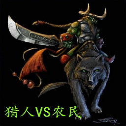

《猎人VS农民》 v7.0 （6.1 重制进化版)
===

#声明
此项目是开源的，所用到的开发工具，开发语言以及代码库均开源，不涉及版权问题
- - -

#简介
《猎人VS农民》是一张经典的对抗地图，关于该地图的历史渊源在后面会提到，喜欢这个图的玩家都简称它为《猎农》。《猎农》系列比较知名有国外汉化版《猎农》，国产《猎农6.1》、《猎农0.69》。
本项目取得原作者YS的授权对《猎农6.1》进行重制优化，并以全新版本v7.0发布。
- - -

#改动
>War3经典对抗地图《猎人VS农民》的重制版，包括了以下内容（依重要程度排列）：

>1. 用vJass重写了所有触发器，减少内存泄露，降低网络延迟和掉线率
2.  去除所有农民牲口的游荡者技能（羊，鸡等动物不再四处乱跑）
    *   基于性能的考虑， 此改动能大幅缓解农民后期暴兵导致的卡顿问题
3.  地图大小会根据猎人玩家人数自动调整  
4.  猎人模型和属性做了调整：
    *   猎人模型变得更炫酷了
    *   随机猎人奖励增加（HP+1000，护甲+1，敏捷+3，智力+2）
    *   猎人属性微调（比如：屠宰者初始生命值为4000，比其他猎人多500）
    *   猎人的名字会有一定概率被随机冠名为某些知名猎农玩家
5.  增加了若干主机命令和玩家辅助命令以及游戏模式（详细信息参考本页的‘资料’章节）
6.  重做了排行榜面板

- - -

#资料
##玩法介绍（）
>未完成

##技能
*图标*  | *技能名*  |  *说明*
------  | --------  | ------
        | 岗哨守卫  | 待续
 | 护甲加强  | 待续

##命令

*格式*  | *适用者*  |  *分类*   | *说明*
------  | --------  | -------   | ------
-sp     | 主机      | 游戏模式  | 洗牌模式：在游戏开始时所有玩家被随机分配阵营
-dr     | 主机      | 游戏模式  | 死亡竞赛模式：猎人无法复活为骷髅，农民只有5次重生机会
---     | ----      | --------  | -----------------------------------------------------
-na     | 主机      | 游戏参数  | 禁止自动调整地图大小（No Adjust）
-nv     | 主机      | 游戏参数  | 禁止投票决定游戏时间（No Vote），使用默认50分钟倒计时
-nu     | 主机      | 游戏参数  | 禁止英雄单位转职为高阶职业（No Upgrade），未完成
---     | ----      | --------  | -----------------------------------------------------
-kick   | 主机      | 游戏辅助  | 踢出玩家，比如-kick 2，玩家2将被踢出游戏
-help   | 所有玩家  | 游戏辅助  | 显示帮助信息
-gi     | 所有玩家  | 游戏辅助  | 显示基本游戏信息（Game Info）
-sa     | 所有玩家  | 游戏辅助  | 显示盟友基本信息（Show Ally）
-se     | 所有玩家  | 游戏辅助  | 显示敌方基本信息（Show Enemy）

注：

1.  所有 * 分类 * 为游戏模式和游戏参数的主机命令都是combo命令，即几个命令可以连起来，比如-spdrna表示
游戏模式为：洗牌模式/死亡竞赛模式， 游戏参数为：禁止调整
2.  当你需要帮助时，请敲-help

- - -

#作者

- - -

#现存版本及现状
##历史
>《猎人VS农民》的具体历史已经无法追溯，但最早版本的《猎人VS农民》是一张国外地图《HuntersVsFarmers》的汉化版，比较著名的有《猎人VS农民》 ver3.1，下文简称《__猎农3.1__》。国人YS受该图启发，自己制作了国产版《猎人VS农民》并将地图发布在通魔作坊旗下，历史版本有5.1-6.1, 《__猎农6.1__》是该系列最后一个版本。 随后YS以个人名义发布了0.69版（《__猎农0.69__》）（不要问我版本号怎么这么混乱=  =！）。然后就。。。消失了。。。

##各版本优缺点以及对比
###《猎农3.1》
-   优点：
    *   地图地形简单，农民操作简易，新人容易上手
    *   好吧，汉化的翻译也算比较诙谐
-   不足：
    *   成也简单，败也简单，猎人与农民之间的对抗方式永远都是那么简单，比如：猎人的侦察靠经验，只要记住几个固定的点就OK，农民也不用考虑怎么躲避侦察，因为猎人就没有侦察手段。诸如此类，一言以蔽之，虽然是一款躲猫猫游戏，但躲得人没办法猥琐起来，就好像房间里就几块木板，你一块一块揭开来看总能找到，有点索然无味的感觉。
    *   道具的种类繁多，但大多并无特色，能用到的就那么几种，隐身药水，翻妈地雷，乌云号角等
-   点评：有句话说得好‘The simplest the best’，最简单的就是最好的，我虽然不认为它是最好的，但不得不承认在现在这个快餐便当游戏横行的时代，它以它的简单获得了存活的空间。
    *   上手度：★★★★☆
    *   可玩性：★★☆☆☆

###《猎农6.1》
-   优点：
    *   待续
-   不足：
    *   待续
-   点评：待续
    *   上手度：★★☆☆☆
    *   可玩性：★★★★☆

- - -

#鸣谢（Thanks To：）

- - -

######联系方式：
QQ:`2872618576`

E-mail:hvfdev@qq.com
